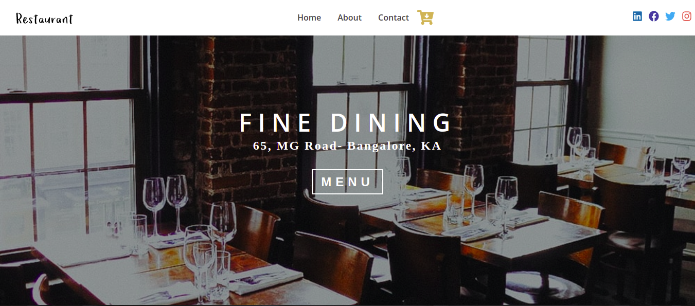
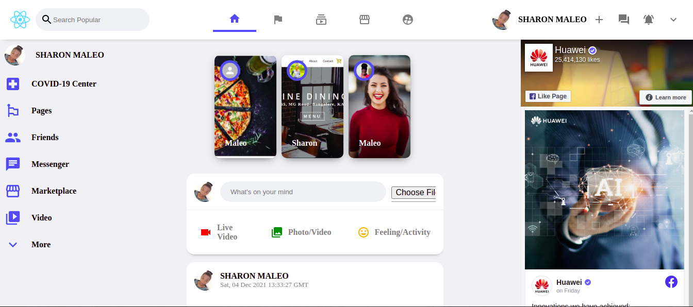

## Hello, 

[](https://maleo-portfolio.netlify.app)

[](https://app.netlify.com/sites/maleo-portfolio/deploys)


<h1>Check out: 
  <a href="https://maleo-portfolio.netlify.app/" rel="noreferer noopener" target="_blank">
  
  </a>
</h1>

## I'm Sharon Leshan
I am a Fullstack Javascript Developer.
I have specialized in MERN Stack, HTML 5, CSS 3 

#### Top Technologies

<!-- TODO: Make technologies links takes you to repositories -->

[](#) [](#) [](#) [](#)


<!--START_SECTION:waka-->
```text
JavaScript   19 hrs 45 mins  ████████████████████▒░░░░   81.08 % 
SCSS         2 hrs 33 mins   ██▓░░░░░░░░░░░░░░░░░░░░░░   10.50 % 
JSON         1 hr 21 mins    █▒░░░░░░░░░░░░░░░░░░░░░░░   05.57 % 
Other        11 mins         ▒░░░░░░░░░░░░░░░░░░░░░░░░   00.79 % 
Git Config   10 mins         ▒░░░░░░░░░░░░░░░░░░░░░░░░   00.73 % 
```
<!--END_SECTION:waka-->

## 
▶ Sample Projects
<table>
  <tbody>
    <tr>
    <td>
        <a href="https://maleo-restaurant.netlify.app/">
          
        </a>
      </td>
      <td>
        <a href="https://maleo-restaurant.netlify.app/">Restaurant E-commerce</a>
       </td>
      <td>
      <a href="https://popular-social-mern-a9128.web.app/">Popular Social App</a>
     </td>
      <td>
        <a href="https://popular-social-mern-a9128.web.app/">
          
        </a>
      </td>  
    </tr>
     <tr>
      <td>
      <a href="https://shazy-agency-site.netlify.app/">
        
      </a>
    </td>
    <td>
      <a href="https://shazy-agency-site.netlify.app/">Agency Site</a>
     </td>
    <td>
      <a href="https://messaging-app-ui.netlify.app/">
        
      </a>
    </td>
    <td>
      <a href="https://messaging-app-ui.netlify.app/">Messaging UI</a>
     </td>
   </tr>
  <tr>
    <tr>
     <td>
      <a href="https://maleo-dating-app.netlify.app/">
        
      </a>
    </td>
    <td>
      <a href="https://maleo-dating-app.netlify.app/">Popular Social App</a>
     </td>
      <td>
        <a href="https://popular-social-mern-a9128.web.app/">
          
        </a>
      </td>
      <td>
        <a href="https://popular-social-mern-a9128.web.app/">Wrapper Example</a>
       </td>    
    </tr>
  </tbody>
</table>
 
 <br />
 
 - Certifications
 
 <table>
  <tbody>
    <tr>
      <td>
        <a href="https://www.hackerrank.com/certificates/055e1dcd0a66">
          
        </a>
      </td>
      <td>
        <a href="https://www.hackerrank.com/certificates/055e1dcd0a66">Verify</a>
       </td>
      <td>
        <a href="https://www.hackerrank.com/certificates/8d456c864dfe">
          
        </a>
      </td>
      <td>
        <a href="https://www.hackerrank.com/certificates/8d456c864dfe">Verify</a>
       </td>
    </tr>
     <tr>
      <td>
        <a href="https://www.freecodecamp.org/certification/maleo/responsive-web-design">
          
        </a>
      </td>
      <td>
        <a href="https://www.freecodecamp.org/certification/maleo/responsive-web-design">Verify</a>
       </td>
      <td>
        <a href="https://www.freecodecamp.org/certification/maleo/javascript-algorithms-and-data-structures">
          
        </a>
      </td>
      <td>
        <a href="https://www.freecodecamp.org/certification/maleo/javascript-algorithms-and-data-structures">Verify</a>
       </td>
    </tr>
     <tr>
      <td>
        <a href="https://www.freecodecamp.org/certification/maleo/front-end-development-libraries">
          
        </a>
      </td>
      <td>
        <a href="https://www.freecodecamp.org/certification/maleo/front-end-development-libraries">Verify</a>
       </td>
       <td>
        <a href="https://maleo-portfolio.netlify.app/certification">
          
        </a>
      </td>
      <td>
        <a href="https://maleo-portfolio.netlify.app/certification">Verify</a>
       </td>
      <td>
    </tr>
  </tbody>
  </table>
 
<h2 align="center">Contact Me</h2>
<p align='center'>
  <a href="https://www.linkedin.com/in/sharon-maleo/">
    
  </a>&nbsp;&nbsp;
  <a href="https://instagram.com/shazy_leshan">
            
  </a>&nbsp;&nbsp;
 <a href="https://wa.me/+25496531442">
  
 </a>&nbsp;&nbsp;
 <a href="mailto:maleos380@gmail.com">
  
 </a>&nbsp;&nbsp;
</p>

<p align='center'>
  <a href="https://twitter.com/shazyleshan">
    
  </a>&nbsp;&nbsp;
  <a href="https://github.com/sharon-leshan">
            
  </a>&nbsp;&nbsp;
</p>

<h1>
<details>
  <summary>Skills</summary>
  
  
  
  
  
  
  
  
  
  
  
  
  
  

  

  
  
  
  
  

  
  

  
  
  
  
  
  
  
  
  
  
  
  
  
  
  

</details>
</h1>


## Contribution Graph
<p>
  
</p> &nbsp;
<br />

### 🏆 My Trophies
  [](https://github.com/sharon-leshan/sharon-leshan)
### Github Stats


### Github extra pins

[](https://github.com/sharon-leshan/sharon-leshan&show_owner=true&count_private=true)

### Compact language card layout

[](https://github.com/sharon-leshan/sharon-leshan)

### Wakatime Week Stats

[](https://github.com/sharon-leshan/sharon-leshan)

[](https://wakatime.com/@f6d97325-e131-4c48-9dbc-46089cd0f41a)

### Profile Visit


[](https://github.com/sharon-leshan/sharon-views-counter)
