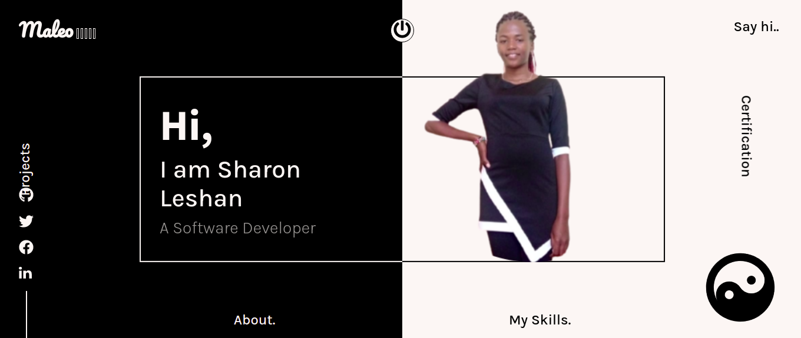
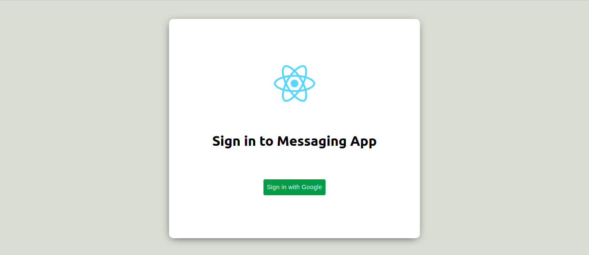
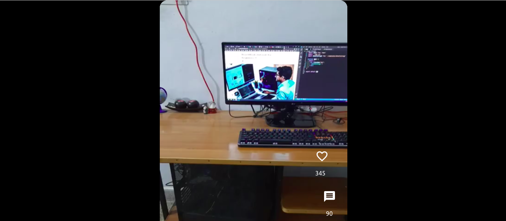
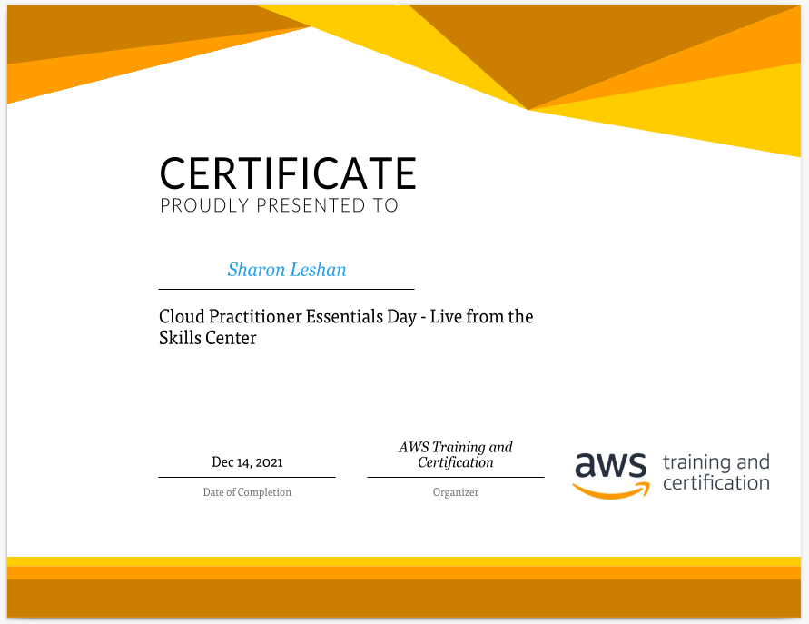
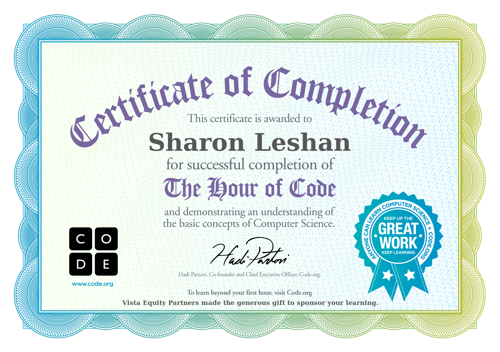
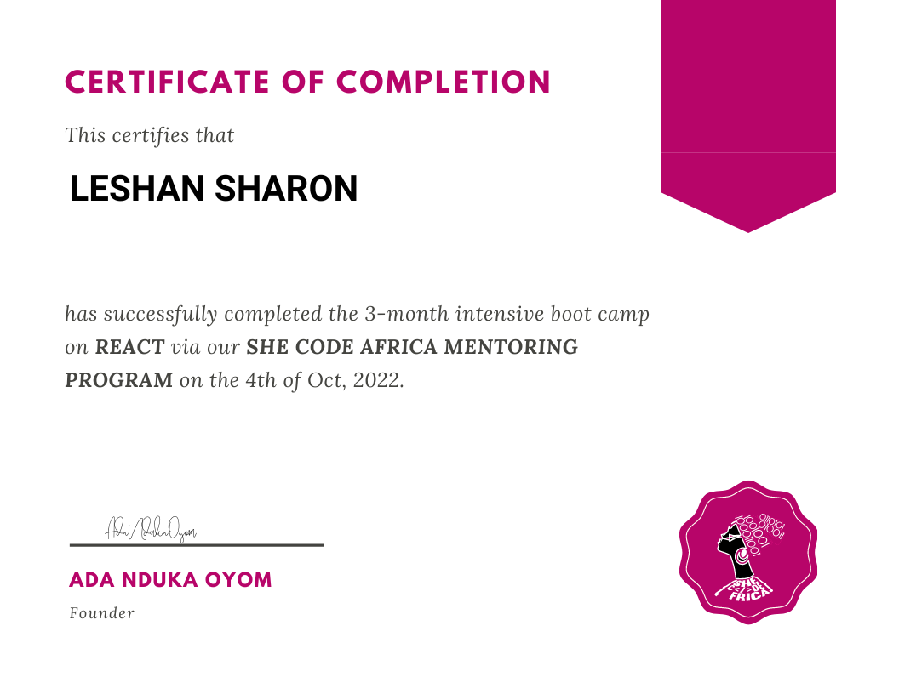

## Hi  ,

[](https://maleo-portfolio.netlify.app)

[](https://app.netlify.com/sites/maleo-portfolio/deploys)  

Check out my [`portfolio`](https://maleo-portfolio.netlify.app)
 
<!--  [Google](https://g.dev/sharon-maleo) -->
 
[](https://git.io/typing-svg)

A self-driven individual with skills and expertise in developing
applications and websites. Anxious to put my creativity and passion to work.
Maximize my ability and skills to stay at the forefront of current trends. I work best in a team of motivated individuals who are focused on the
advancement of a company. 

Fullstack Developer Skills (React, Gatsby, Node, GraphQL, MongoDB, MySQL, PostgreSQL, TypeScript, Twilio, Firebase, Snipcart, Pusher, CMS, Disqus, Formspree)

#### Top Technologies

<!-- TODO: Make technologies links takes you to repositories -->

[](#) [](#) [](#) [](#)

### 📊 Monthly development breakdown
<!--START_SECTION:waka-->

```txt
From: 28 October 2025 - To: 27 November 2025

No activity tracked
```

<!--END_SECTION:waka-->


### Experience

<p align="left">
  
  
  
  
  
  
  <!--  -->
  
  
<!--  -->
  
  
    
  
  
</p>

## 
▶ Sample Projects
<table>
  <tbody>
    <tr>
    <td>
        <a href="https://maleo-restaurant.netlify.app/">
          
        </a>
      </td>
      <td>
        <a href="https://maleo-restaurant.netlify.app/">Restaurant E-commerce</a>
        <br />
        <a href="https://github.com/sharon-leshan/restaurant">
          
        </a>
       </td>
     </td>
      <td>
        <a href="https://popular-social-mern-a9128.web.app/">
          
        </a>
      </td>
      <td>
      <a href="https://popular-social-mern-a9128.web.app/">Popular Social App</a>
      <br />
        <a href="https://github.com/sharon-leshan/popular-social-mern">
          
        </a>
      </td>
    </tr>
     <tr>
      <td>
      <a href="https://shazy-agency-site.netlify.app/">
        
      </a>
    </td>
    <td>
      <a href="https://shazy-agency-site.netlify.app/">Agency Site</a>
      <br />
        <a href="https://github.com/sharon-leshan/agency-site">
          
        </a>
     </td>
    <td>
      <a href="https://messaging-app-ui.netlify.app/">
        
      </a>
    </td>
    <td>
      <a href="https://messaging-app-ui.netlify.app/">Messaging App</a>
      <br />
        <a href="https://github.com/sharon-leshan/messaging-app-ui">
          
        </a>
     </td>
   </tr>
    <tr>
     <td>
      <a href="https://dating-app-mern-2da3b.web.app/">
        
      </a>
    </td>
    <td>
     <a href="https://dating-app-mern-2da3b.web.app/">Dating App</a>
     <br />
        <a href="https://github.com/sharon-leshan/dating-app">
          
        </a>
    </td>
      <td>
      <a href="https://maleo-recipes-homemade.netlify.app/">
        
      </a>
    </td>
    <td>
     <a href="https://maleo-recipes-homemade.netlify.app/">Recipe Homemade</a>
     <br />
        <a href="https://github.com/sharon-leshan/recipes-homemade">
          
        </a>
    </td>   
    </tr>
    <tr>
     <td>
      <a href="https://short-video-frontend.netlify.app/">
        
      </a>
    </td>
    <td>
     <a href="https://short-video-frontend.netlify.app/">Short Video App</a>
     <br />
        <a href="https://github.com/sharon-leshan/short-video-frontend">
          
        </a>
    </td>
    </tr>
  </tbody>
</table>
 
 <br />
 
## Certifications
 
 <table>
  <tbody>
    <tr>
      <td>
        <a href="https://www.hackerrank.com/certificates/055e1dcd0a66">
          
        </a>
      </td>
      <td>
        <a href="https://www.hackerrank.com/certificates/055e1dcd0a66">Verify</a>
       </td>
      <td>
        <a href="https://www.hackerrank.com/certificates/8d456c864dfe">
          
        </a>
      </td>
      <td>
        <a href="https://www.hackerrank.com/certificates/8d456c864dfe">Verify</a>
       </td>
    </tr>
     <tr>
      <td>
        <a href="https://www.freecodecamp.org/certification/maleo/responsive-web-design">
          
        </a>
      </td>
      <td>
        <a href="https://www.freecodecamp.org/certification/maleo/responsive-web-design">Verify</a>
       </td>
      <td>
        <a href="https://www.freecodecamp.org/certification/maleo/javascript-algorithms-and-data-structures">
          
        </a>
      </td>
      <td>
        <a href="https://www.freecodecamp.org/certification/maleo/javascript-algorithms-and-data-structures">Verify</a>
       </td>
    </tr>
     <tr>
      <td>
        <a href="https://www.freecodecamp.org/certification/maleo/front-end-development-libraries">
          
        </a>
      </td>
      <td>
        <a href="https://www.freecodecamp.org/certification/maleo/front-end-development-libraries">Verify</a>
       </td>
       <td>
        <a href="https://maleo-portfolio.netlify.app/certification">
          
        </a>
      </td>
      <td>
        <a href="https://maleo-portfolio.netlify.app/certification">Verify</a>
       </td>
    </tr>
    <tr>
    <td>
        <a href="https://maleo-portfolio.netlify.app/certification">
          
        </a>
      </td>
      <td>
        <a href="https://maleo-portfolio.netlify.app/certification">Verify</a>
       </td>
       <td>
        <a href="https://code.org/congrats?i=_1_a7e6ad3780d6e6e4bbae9992beeaf811">
          
        </a>
      </td>
      <td>
        <a href="https://code.org/congrats?i=_1_a7e6ad3780d6e6e4bbae9992beeaf811">Verify</a>
      </td>
    </tr>
    <tr>
    <td>
        <a href="https://maleo-portfolio.netlify.app/certification">
          
        </a>
      </td>
      <td>
        <a href="https://maleo-portfolio.netlify.app/certification">Verify</a>
       </td>
    </tr>
  </tbody>
  </table>
 
<h2 align="center">Contact Me</h2>
<p align='center'>
  <a href="https://www.linkedin.com/in/sharon-maleo/">
    
  </a>&nbsp;&nbsp;
  <a href="https://instagram.com/shazy_leshan">
            
  </a>&nbsp;&nbsp;
 <a href="https://wa.me/+254796531442">
  
 </a>&nbsp;&nbsp;
 <a href="mailto:maleos380@gmail.com">
  
 </a>&nbsp;&nbsp;
</p>

<p align='center'>
  <a href="https://twitter.com/shazyleshan">
    
  </a>&nbsp;&nbsp;
  <a href="https://github.com/sharon-leshan">
            
  </a>&nbsp;&nbsp;
</p>
<!-- 
    
  
  
  
  
  
  
  
  
  
 
    
  
    
    
    
      

 -->
<!--  


 -->

## Contribution Graph

[](https://github.com/ashutosh00710/github-readme-activity-graph)


### 🏆 My Trophies

[](https://github.com/sharon-leshan/sharon-leshan)

### Github Stats

<p></p>      


### Github extra pins

[](https://github.com/sharon-leshan/sharon-leshan&show_owner=true&count_private=true)

### Compact language card layout

[](https://github.com/sharon-leshan/sharon-leshan)

### Wakatime Week Stats

[](https://github.com/sharon-leshan/sharon-leshan)

[](https://wakatime.com/@f6d97325-e131-4c48-9dbc-46089cd0f41a)

<p>
  <a href="https://github.com/sharon-leshan?tab=followers">
    
  </a>
</p>

### Unique Visits
[](https://github.com/sharon-leshan/sharon-views-counter)

### 😂 Here is a random joke for you today: -


### Star my projects [here](https://github.com/sharon-leshan?tab=repositories)
:relaxed:__Follow for Follow back__:relaxed:

